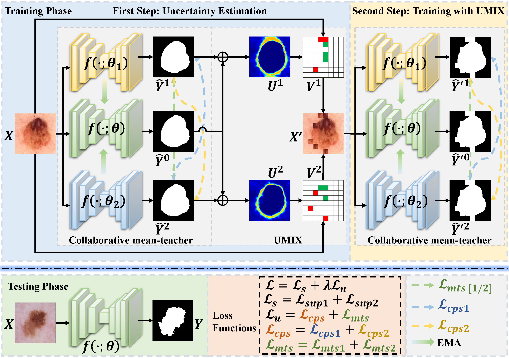

# [IJCAI 2023] UCMT

This repo is the PyTorch implementation of our paper:

**["Co-training with High-Confidence Pseudo Labels for Semi-supervised Medical Image Segmentation"](https://arxiv.org/abs/2301.04465)** 




**U**ncertainty-guided **C**ollaborative **M**ean-**T**eacher (UCMT)

## Usage

### 0. Requirements
The code is developed using Python 3.7 with PyTorch 1.11.0. 
All experiments in our paper were conducted on a single NVIDIA Quadro RTX 6000 with 24G GPU memory.

Install from the ```requirements.txt``` using:
```angular2html
pip install -r requirements.txt
```

### 1. Data Preparation
#### 1.1. Download data
The original data can be downloaded in following links:
* ISIC Dataset - [Link (Original)](https://challenge.isic-archive.com/data/#2018)

#### 1.2. Split Dataset
The ISIC dataset includes 2594 dermoscopy images and corresponding annotations. 
Split the dataset, resulting in 1815 images for training and 779 images for testing.
```angular2html
python data/split_dataset.py
```
Then, the dataset is arranged in the following format:
```
DATA/
|-- ISIC
|   |-- TrainDataset
|   |   |-- images
|   |   |-- masks
|   |-- TestDataset
|   |   |-- images
|   |   |-- masks
```

### 2. Training
#### 2.1 Adopting DeepLabv3Plus as backbone:
```angular2html
python train.py --backbone Deeplabv3p
```
#### 2.2 Adopting U-Net as backbone:
```angular2html
python train.py --backbone UNet
```

### 3. Evaluation
```angular2html
python eval.py
```

### 4. Visualization
```angular2html
python visualization.py
```


## Citation
If you find this project useful, please consider citing:
```
@article{shen2023co,
  title={Co-training with High-Confidence Pseudo Labels for Semi-supervised Medical Image Segmentation},
  author={Shen, Zhiqiang and Cao, Peng and Yang, Hua and Liu, Xiaoli and Yang, Jinzhu and Zaiane, Osmar R},
  journal={arXiv preprint arXiv:2301.04465},
  year={2023}
}
```

## Contact
If you have any questions or suggestions, please feel free to contact me ([xxszqyy@gmail.com](xxszqyy@gmail.com)).

## Acknowledgements
* [TorchSemiSeg](https://github.com/charlesCXK/TorchSemiSeg) 
* [UA-MT](https://github.com/yulequan/UA-MT)
* [SSL4MIS](https://github.com/HiLab-git/SSL4MIS)
